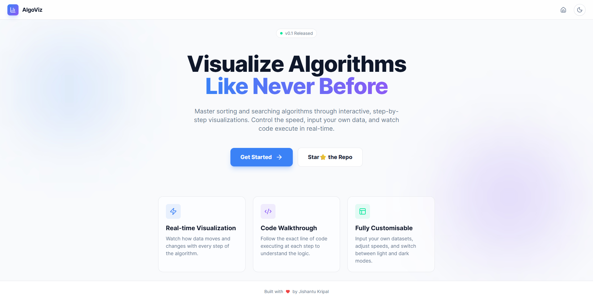

# ⚡ AlgoViz

> **Visualize C++ Algorithms Like Never Before.**

**AlgoViz** is an interactive, real-time algorithm visualizer designed to help students and developers master **Sorting** and **Searching** concepts. Watch code execute step-by-step, control the speed, and switch between themes to suit your vibe.

### 🔴 [**View Live Project**](https://cppalgoviz.netlify.app/)

## 📸 Preview

---

## 🚀 Features

### 🌓 Theme Support
* **Dark & Light Mode:** Whether you prefer a sleek dark interface for late-night coding or a bright, crisp look for presentations, switch modes instantly with a single click.

### 📊 Sorting Algorithms
Visualize how data moves and swaps with precision:
* **Bubble Sort:** Watch the largest elements "bubble" to the top.
* **Selection Sort:** See how the smallest element is selected in each pass.
* **Insertion Sort:** Understand how cards are sorted in a hand.
* **Merge Sort:** Visualize the divide-and-conquer strategy in action.

### 🔍 Searching Algorithms
* **Linear Search:** Iterate through data one by one.
* **Binary Search:** Visualize the power of dividing the search space.

### 🎛️ Interactive Controls
* **Speed Control:** Slow down to understand, speed up to scan.
* **Custom Inputs:** Test edge cases with your own datasets.
* **Step-by-Step Execution:** Pause, play, and step through the logic.

---

## 📬 Get in Touch

**Jishantu Kripal Bordoloi** ( [links.jishantukripal.com](https://links.jishantukripal.com) )

---

### ⚠️ Note
> This project is **created by vibe coding**. 🎧✨
> There are scope for improvements, and exciting new features are coming soon! Stay tuned.
